# Open Data Hub - AutoGluon Multimodal Support

|                |            |
| -------------- | ---------- |
| Date           | 2026-10-05 |
| Scope          | AutoML Component |
| Status         | Proposed |
| Authors        | Lukasz Cmielowski |
| Supersedes     | N/A |
| Superseded by: | N/A |
| Tickets        | N/A |
| Other docs:    | [ODH-ADR-0001](./ODH-ADR-0001-automl.md) · [ODH-ADR-0002](./ODH-ADR-0002-experiment-settings.md) · [ODH-ADR-0003](./ODH-ADR-0003-model-insights.md) · [ODH-ADR-0004](./ODH-ADR-0004-mlflow-integration.md) |

## What

Extend OpenShift AI AutoML with a generic **AutoGluon MultiModal (AutoMM) training path**, alongside—not inside—the existing tabular and time-series pipelines. The first implemented branch is image prediction.

The first supported workload is supervised image classification and regression, with an optional mix of image, numeric, categorical, and text feature columns. It uses AutoGluon's `MultiModalPredictor`, which fine-tunes a pretrained vision model and, for mixed data, fuses the representations from the available modalities. This ADR deliberately does not commit the initial release to object detection, segmentation, semantic matching, zero-shot, document, audio, or arbitrary multimodal tasks.

This decision changes the non-goal for non-tabular data in [ODH-ADR-0001](./ODH-ADR-0001-automl.md): images are in scope only through the new, bounded AutoMM pipeline contract defined here. The existing tabular and time-series contracts remain unchanged.

## Why

Image datasets are common in quality inspection, retail, geospatial analysis, life sciences, and document-adjacent workflows. Users need a supported route from an S3-hosted image dataset to a registered and deployable predictor without writing a custom PyTorch training workflow.

AutoMM is appropriate because it accepts image-only data as well as image, text, and tabular columns in a DataFrame, and exposes a common predictor API for fit, evaluation, prediction, probability prediction, and embeddings. It is not interchangeable with `TabularPredictor`: it is a deep-learning workload with PyTorch/CUDA dependencies, pretrained-model acquisition, materially larger artifacts, GPU scheduling needs, and an image/bytes inference request.

## Decision

Provide a **new, independently versioned `autogluon_multimodal_training_pipeline`**. It has its own public pipeline contract, KFP components, GPU resource profile, artifacts, and serving integration. It is a branching pipeline: a common multimodal lifecycle selects a task-family branch, and each branch owns its validation, training configuration, metrics, artifacts, and inference schema. Do not add an `image` task type, image parameters, or an AutoMM execution mode to `autogluon_tabular_training_pipeline`; the existing tabular and time-series pipelines remain unchanged. Do not reuse tabular's selection/refit/top-N semantics.

The initial public product contract is the `image_prediction` branch:

| Area | Initial support |
| --- | --- |
| Predictor | `autogluon.multimodal.MultiModalPredictor`, version pinned by the training and serving images |
| Learning tasks | Binary classification, multiclass classification, and regression |
| Modalities | One image column; optional text, numeric, categorical, and boolean feature columns in the manifest |
| Image inputs | PNG, JPEG, WebP, and other Pillow-supported raster formats that pass validation; one primary image per row for the initial UX |
| Training data | A CSV or Parquet manifest plus image objects in S3-compatible storage |
| Compute | GPU required for the supported production profile; CPU execution may be used only for development and compatibility testing |
| Output | One saved `MultiModalPredictor` per completed backbone in the curated sweep, a run-level leaderboard, evaluation/diagnostic artifacts, and notebooks |
| Serving | A dedicated AutoMM ServingRuntime and image-aware v1/v2 request adapter; it is not the existing tabular AutoGluon runtime until proven compatible |

A single AutoMM `fit()` still produces **one** `MultiModalPredictor`. AutoMM does not emit a `TabularPredictor.leaderboard()` of independently deployable models. Soup checkpoints, discarded HPO trials, and the image/text towers inside one fusion model are **not** leaderboard rows.

Multiple leaderboard rows come only from **pipeline-owned backbone sweep**: the pipeline runs several independent `MultiModalPredictor.fit` calls on the same staged and split data, each with a different curated TIMM checkpoint; calls `evaluate()` on each saved predictor; and writes a run-level leaderboard. Each row is a real saved predictor directory the user can register and deploy. Do not reuse tabular `top_n`, sampled selection, full refit, or `clone_for_deployment`. Do not surface AutoMM HPO trial leftovers or soup checkpoints as models.

## Goals

* Establish a generic multimodal pipeline foundation that can gain task-family branches without changing tabular or time-series contracts.
* Give Dashboard and API users one clear image-first AutoML path that can also exploit accompanying tabular and text columns.
* Keep existing tabular and time-series API, artifacts, presets, and runtime behavior stable.
* Support reproducible GPU training and inference through pinned, tested container images.
* Define an S3 data contract that is secure, portable, and workable for large image collections.
* Emit one or more deployable predictors from a curated backbone sweep, a run-level leaderboard of those saved predictors, and an explicit inference schema; do not require scoring clients to expose S3 credentials or paths.
* Preserve the existing KFP, RHOAI Connection, MLflow, Model Registry, and KServe integration boundaries.
* Establish measurable promotion gates before this becomes a supported product path.

## Non-Goals

* Replacing the tabular or time-series pipelines, or combining their parameters into one polymorphic pipeline.
* Object detection, instance/semantic segmentation, image/text similarity, zero-shot classification, feature extraction, OCR/PDF, video, audio, NER, or generative image tasks in the first release.
* Arbitrary directory layouts, archives, HTTP URLs, or data embedded directly in pipeline parameters.
* A general-purpose experiment/HPO platform for every AutoMM model or model zoo, or exposing AutoMM HPO trials, greedy-soup checkpoints, or fusion towers as separate leaderboard models.
* Multi-GPU or distributed training in the initial release.
* Automatically registering or deploying a model as a training-pipeline step.
* Guaranteeing that a predictor trained on one AutoGluon/PyTorch/CUDA combination loads in an unpinned, arbitrary runtime.

## How

### Data contract and ingestion

The pipeline accepts a **manifest**, not an image archive. The manifest is CSV or Parquet and has one row per training example. It must include a label column and at least one declared image column. Image column values are relative object keys below `image_prefix`, never arbitrary local paths or URLs. The loader retrieves the manifest and required objects with the supplied namespace-scoped RHOAI Connection, materializes them into an ephemeral working volume, and rewrites image values to local paths before calling AutoMM.

Example manifest:

```csv
image_key,product_title,weight_grams,category
images/0001.jpg,Blue running shoe,310,shoe
images/0002.jpg,Canvas tote bag,460,bag
```

The loader must reject traversal (`..`), absolute paths, unsupported/missing objects, unreadable or corrupt images, duplicate row identifiers, an empty label, and an insufficient per-class sample count. It records counts for invalid and dropped rows; the default product policy is **fail before training if any requested training image cannot be read**. A future explicit `invalid_image_policy=drop` may be added only with a visible data-quality report and a defined threshold.

The initial contract intentionally supports one image per row. AutoMM can consume multiple images represented in a cell, but multiple-image ordering, missing-image behavior, request size, and serving schema need a dedicated design rather than an accidental semicolon convention.

### Public pipeline parameters

Names are proposed here and become stable only when implemented in `pipelines-components` and reviewed with Dashboard/API consumers.

| Parameter | Type | Required | Description |
| --- | --- | --- | --- |
| `train_data_secret_name` | `str` | Yes | S3-compatible Connection Secret, using the existing AutoML credential-key convention. |
| `train_data_bucket_name` | `str` | Yes | Bucket containing the manifest and image prefix. |
| `train_data_file_key` | `str` | Yes | Object key of the CSV or Parquet manifest. |
| `task_family` | `str` | Yes | Selects the multimodal branch. Initial and only supported value is `image_prediction`; future values require their own validated contract. |
| `image_prefix` | `str` | Yes | Object-key prefix used to resolve relative values in image columns. |
| `label_column` | `str` | Yes | Target column. It is not a scoring input. |
| `image_columns` | `List[str]` | Yes | Manifest columns containing relative image keys. Initial Dashboard flow permits exactly one. |
| `task_type` | `str` | Yes | `binary`, `multiclass`, or `regression`. |
| `test_data_bucket_name` / `test_data_file_key` | `Optional[str]` | No | Paired external evaluation manifest, using the same connection and schema. |
| `validation_fraction` | `float` | No | Holdout fraction when no external test data is supplied; stratified for classification when possible. |
| `preset` | `str` | No | Product-level GPU quality tier; see below. |
| `eval_metric` | `Optional[str]` | No | AutoMM metric valid for `task_type`; default resolves to AutoMM's problem-type default. |
| `time_limit_seconds` | `int` | No | Per-backbone AutoMM `fit` time budget, excluding download, staging, and upload. Sequential sweep wall-clock time scales with the number of backbones. |
| `random_seed` | `int` | No | Controls split and training seed to the extent supported by the pinned stack. |
| `model_family` | `str` | No | Pin the run to a single curated backbone. When omitted, `preset` selects the sweep set. No arbitrary TIMM/Hugging Face identifier in the initial API. |

Only the manifest goes through a pipeline parameter. Credentials remain in the Secret, and image bytes never appear in KFP parameters, KFP metadata, MLflow parameters, logs, or notebook output.

### Pipeline shape

```mermaid
flowchart LR
    A[S3 manifest + image objects] --> B[Validate manifest and images]
    B --> C[Stage data to ephemeral volume]
    C --> D[Split or read external test manifest]
    D --> E[Curated backbone sweep]
    E --> F[GPU: MultiModalPredictor.fit per backbone]
    F --> G[evaluate each saved predictor]
    G --> H[Run-level leaderboard]
    H --> I[Per-backbone predictor artifacts]
    I -. post-pipeline .-> J[Model Registry]
    J --> K[AutoMM ServingRuntime on KServe]
```



Components required in `pipelines-components` are: manifest/image validation and staging; deterministic split; AutoMM training; evaluation/diagnostics; leaderboard assembly; model packaging; notebook generation; and stage-map/MLflow publishing. The image staging component should stream or parallelize transfers with bounded concurrency and disk usage, clean its workspace on exit, and never log credentials or presigned URLs.

The training step needs a GPU node selector/toleration policy compatible with the platform's HardwareProfile and a per-run PVC or `emptyDir` sized for the staged data, model downloads, checkpoints, and final artifacts. It must set CPU, memory, ephemeral-storage, GPU requests and limits, termination grace time, and a timeout. Queueing due to unavailable GPUs is a normal KFP condition and must be visible to the user.

### Backbone sweep and leaderboard

AutoMM fine-tunes one pretrained backbone (or one fused image/text/tabular network) per `MultiModalPredictor.fit`. A product leaderboard of "which backbone won" is therefore **orchestration**, not an AutoMM API.

The pipeline owns a **curated sweep**:

1. Stage and split the dataset once. Every backbone in the run trains and evaluates on that same data.
2. Resolve the backbone list from `preset`, or the single identity in `model_family` when set. The list is a small, license-reviewed TIMM set shipped with the training image. Users cannot pass an arbitrary checkpoint name.
3. For each backbone, call `MultiModalPredictor.fit` with that `model.timm_image.checkpoint_name` (and the same label, task, metric, seed, and per-fit `time_limit_seconds`), save the predictor, then `evaluate()` it on the holdout or external test split.
4. Write a run-level leaderboard ranked by `eval_metric`. Each row names the backbone id, the evaluation scores, fit duration, and the path to that predictor directory.
5. Package every completed predictor as a registerable artifact. The user selects which row to register, the same way they pick a tabular `*_FULL` directory. There is no extra refit stage.

Fits run **sequentially on one GPU** in the initial release so a `balanced` sweep does not require N accelerators. A later revision may parallelize independent fits after quota and node-pool behavior are proven. A failed backbone must not discard siblings that already completed; the leaderboard records the failure and ranks the successful predictors.

Do not treat the following as leaderboard rows: greedy-soup checkpoints of one fit; AutoMM HPO trials that AutoGluon drops after keeping the best; the separate image and text towers inside one fusion model; tabular tree models scored on image path strings.

### Quality tiers, resources, and provenance

`speed` and `balanced` are product labels, not aliases for the existing tabular/time-series presets. The initial resource envelope is a starting point for benchmark validation, not a guaranteed fit for every image resolution or backbone.

| Tier | Intent | Starting request | Initial model policy |
| --- | --- | --- | --- |
| `speed` | Fast feedback and small/medium datasets | 1 GPU with at least 16 GiB VRAM, 8 vCPU, 32 GiB RAM, 100 GiB ephemeral/PVC | One curated small/medium TIMM backbone; mixed precision when supported; bounded image size and batch size |
| `balanced` | Compare a short curated set on one GPU | 1 GPU with at least 24 GiB VRAM, 16 vCPU, 64 GiB RAM, 200 GiB ephemeral/PVC | Two or three license-reviewed TIMM backbones, each a full `fit` + `evaluate`, sequential on the same GPU, longer per-fit time budget |

Before GA, benchmarking must establish input-size limits, minimum dataset/class sizes, batch-size defaults, median/p95 training time, GPU memory peak, final artifact size, cold-start time, and accuracy baselines for representative image-only and image-plus-tabular datasets. The implementation must make CUDA/PyTorch, AutoGluon, Python, backbone, model revision/checksum, image transforms, seed, manifest checksum, and resource profile part of `model.json` and MLflow tags.

Pretrained weights are a supply-chain dependency. The supported training image must either contain approved weights or retrieve them through an approved egress/cache path. The exact strategy, licenses, attribution, checksums, and offline behavior are a release gate; no unbounded download from a user-selected model repository is allowed.

### Artifacts, evaluation, and MLflow

Each completed backbone in the sweep is a first-class artifact directory. The run also emits a leaderboard over those directories. This is not tabular `*_FULL` refit layout; directory names are curated backbone ids.

| Path | Content |
| --- | --- |
| `{backbone_id}/predictor/` | Saved `MultiModalPredictor` for that backbone, including required local model/tokenizer/config files. This is the Model Registry / KServe storage URI. |
| `{backbone_id}/model.json` | Predictor type/version, backbone id and checkpoint/checksum, task, class mapping, feature schema, input normalization, artifact compatibility, and serving schema. |
| `{backbone_id}/metrics/metrics.json` | Selected evaluation metric and supported task metrics from `predictor.evaluate`. |
| `{backbone_id}/metrics/confusion_matrix.json` | Classification only, with class order recorded. |
| `{backbone_id}/metrics/per_class.json` | Classification precision, recall, F1, support, and optionally calibrated confidence summaries. |
| `{backbone_id}/metrics/training_summary.json` | Fit duration, hardware profile, best checkpoint summary, model size, and peak resource telemetry where available. |
| `{backbone_id}/notebooks/automl_multimodal_predictor_notebook.ipynb` | Reproducible load/evaluate/predict example using non-sensitive placeholder inputs. |
| `metrics/leaderboard.json` | Run-level ranking of completed backbones by `eval_metric`, with paths to each `{backbone_id}/` directory. Failed backbones are listed with error class, not a fake score. |
| `metrics/data_quality.json` | Manifest/image validation summary, dimensions/formats, split sizes, class distribution, and dropped-row count. Shared by the run; no image content or sensitive paths. |

`model.json` extends the shared contract in [ODH-ADR-0003](./ODH-ADR-0003-model-insights.md) but requires a new `predictor_type: "autogluon.multimodal.MultiModalPredictor"` and `inference.image_inputs` section. Dashboard must branch on predictor type rather than assume the tabular `v1_json.instances.fields` layout. The leaderboard UI may reuse the tabular "pick a row to register" flow, but it must not assume `top_n`, stack level, or `clone_for_deployment`.

The existing [MLflow integration](./ODH-ADR-0004-mlflow-integration.md) remains the parent-run mechanism. Log one nested child run **per completed backbone**, plus parent aggregate status (`num_models_trained` is the number of completed sweep members). Log non-secret configuration, backbone id, data checksum/approved URI, runtime provenance, and evaluation metrics. Log artifact references rather than duplicate large predictor files unless an MLflow artifact-retention policy explicitly authorizes duplication.

### Serving and request contract

The current tabular AutoGluon ServingRuntime must be compatibility-tested, but is **not** assumed to load `MultiModalPredictor`. The implementation creates or certifies a dedicated AutoMM ServingRuntime with the same pinned AutoGluon/Python/PyTorch/CUDA ABI as training. Its startup readiness check must load the predictor and execute a small local smoke prediction before accepting traffic.

For the initial remote API, clients submit image **bytes encoded as base64** (or a KServe v2 `BYTES` tensor) together with scalar companion features. They do not send local paths, S3 URIs, Connection names, or credentials. The adapter decodes each image under strict request-size, media-type, pixel-count, batch-size, and timeout limits; constructs the DataFrame expected by AutoMM; and returns predictions and, when enabled, probabilities. A representative v1 request is:

```json
{
  "instances": [
    {
      "image": {"base64": "..."},
      "product_title": "Blue running shoe",
      "weight_grams": 310
    }
  ]
}
```

The generated model schema specifies required fields, accepted image encoding, maximum decoded bytes/pixels, model input image size, allowed batch size, output labels/class order, and whether probability output is enabled. KServe v2 tensor names and shapes are generated from this schema. Request bodies, decoded images, and inference paths must not be logged; decoded data is retained only for the request lifetime.

GPU inference is the supported default. A CPU-serving variant is permitted only after its latency, memory, and correctness profile is benchmarked and documented. Model Registry registration and KServe deployment continue to be user/platform actions after training.

### Delivery plan and acceptance gates

1. **Technical spike:** build the pinned AutoMM GPU image, train and load a representative image classifier, determine artifact closure/offline behavior, and prove a KServe runtime adapter can serve base64 image bytes.
2. **Pipeline MVP:** implement manifest validation/staging, one-image classification, GPU scheduling, a single-backbone `speed` fit, evaluation, packaging, and MLflow parent/child logging. Keep it feature-gated.
3. **Platform integration:** add Dashboard/API form validation, HardwareProfile/resource selection, Model Registry metadata, dedicated ServingRuntime, and the `balanced` sequential backbone sweep with run-level leaderboard. Add regression, optional text/tabular columns, and external test manifests only after the image-only path is stable.
4. **Promotion:** enable supported availability only when the gates below pass; otherwise retain the feature as Technology Preview/experimental.

Required gates:

* Reproducible train → register → deploy → infer tests on the supported OpenShift AI release and GPU profile.
* Offline/restricted-egress test proves every model dependency is packaged or served from an approved cache.
* Dataset and serving contract negative tests cover corrupt/oversized images, traversal, missing objects, malformed base64, unsupported media, and secret leakage.
* Load compatibility test uses the exact packaged predictor in a fresh serving pod; rollback preserves the previous runtime/image.
* Benchmark evidence supports the declared resource tiers, quotas, timeout defaults, and cost/user guidance.
* Model-quality report includes holdout metrics, class imbalance behavior, data leakage checks, and per-class results for classification.
* Image license, training-data privacy, model-weight license, CVE/SBOM, and supply-chain review are approved.

## Alternatives

### 1. Put image paths into the existing tabular pipeline

**Rejected.** `TabularPredictor` can have image-related capabilities, but it does not establish the AutoMM GPU, artifact, or byte-serving lifecycle required here. It would overload tabular parameters and misrepresent deep-learning training as a tabular ensemble/refit workflow.

### 2. Add a generic “multimodal” pipeline for every AutoMM task now

**Rejected.** AutoMM spans classification, regression, detection, segmentation, similarity, NER, and more. Their datasets, annotations, metrics, dependencies, resource profiles, artifacts, and serving responses differ substantially. Image classification/regression is the narrowest path that validates the platform seams; other tasks require separate ADRs or explicit extensions.

### 3. Support object detection first

**Rejected for the first release.** Detection needs bounding-box annotations and COCO/VOC conversion, detection-specific metrics (for example mAP), optional MMDetection dependencies, different visualization artifacts, and a detection response schema. It should follow once the image classification lifecycle is proven.

### 4. Require users to train custom notebooks and deploy custom runtimes

**Rejected as the supported AutoML path.** It leaves reproducibility, GPU configuration, model provenance, security controls, and Dashboard integration to every user. It remains a valid advanced-user escape hatch.

### 5. Serve by S3 URI or presigned URL

**Rejected.** It would expose storage topology/credentials, complicate tenant boundaries and request auditing, make prediction availability depend on object-store access, and create SSRF-like URL handling risks. Base64 bytes are more portable and keep the model-serving request self-contained.

### 6. Put AutoMM HPO trials or soup checkpoints on the AutoML leaderboard

**Rejected.** AutoGluon keeps the best HPO trial and drops the rest. Greedy-soup checkpoints are internal to one `fit` and are not independently supported deployable predictors. A product leaderboard of backbones is a pipeline sweep of full `fit` + `evaluate` + save, not a reuse of those internals.

## Security and Privacy Considerations

* RHOAI Connections remain namespace-scoped and are used only by training/staging components. Serving never uses training data credentials.
* Treat images, EXIF metadata, filenames, and labels as potentially sensitive. Strip/ignore EXIF where feasible, do not emit samples into logs, MLflow parameters, notebooks, or error messages, and use existing artifact-store access controls.
* Defend ingestion and serving against decompression bombs, malformed image decoders, oversized pixel counts, path traversal, and resource exhaustion with explicit size/dimension/count limits and bounded workers.
* Scan and sign training/serving images; maintain SBOMs and remediation policy for PyTorch, Pillow, Transformers, TIMM, and any optional model-zoo dependency. Pin weights and code revisions with checksums.
* Review dataset consent, biometric/medical/sensitive-image policy, label bias, representational harm, and the licensing/acceptable-use terms of pretrained weights before enabling a model family.
* Apply KServe authentication, authorization, network policy, quotas, and request limits. Image payloads must be redacted from observability data.

## Risks

| Risk | Mitigation |
| --- | --- |
| GPU scarcity, cost, or long queue times | Explicit HardwareProfile, quota guidance, tier-specific limits, sequential sweep on one GPU, visible pending status, and feature gating. Document that `balanced` wall-clock time scales with the number of backbones. |
| GPU out-of-memory or local disk exhaustion | Curated backbones, bounded image resolution/batch size, validated resources, PVC sizing, and benchmark gates. |
| Training/serving incompatibility | One version-pinned image family, packaged dependencies, fresh-pod load tests, and deployment readiness smoke tests. |
| Pretrained-weight download or license failure | Approved internal cache or baked weights, checksum/license review, and restricted-egress testing. |
| Large image payloads degrade serving | Base64/pixel/batch limits, ingress limits, queue/concurrency controls, and documented asynchronous/batch path if later needed. |
| Weak or biased results on sparse/imbalanced data | Minimum-data guidance, stratified splitting where applicable, per-class reporting, and user-visible data-quality warnings. |
| AutoMM upstream API/dependency churn | Pin supported release, maintain an integration test matrix, and upgrade deliberately rather than resolving dependencies at run time. |

## Stakeholder Impacts

| Group | Impact |
| --- | --- |
| AutoML / pipelines-components | New GPU pipeline, data staging, sequential backbone sweep, leaderboard artifacts, tests, and release maintenance. |
| RHOAI Dashboard and API | New dataset form, validation, run presentation, predictor-type branching, backbone leaderboard, and image scoring UX. |
| Data Science Pipelines / platform operators | GPU scheduling, HardwareProfiles, quotas, storage, image lifecycle, and supportability. |
| Model Registry and serving | AutoMM model metadata and a dedicated/certified ServingRuntime. |
| MLflow integration | One child run per completed backbone and larger artifact/provenance handling. |
| Security, legal, and product | Data/weight licensing, supply-chain review, privacy policy, and support-tier decision. |

## References

* [AutoGluon MultiModal documentation](https://auto.gluon.ai/stable/tutorials/multimodal/index.html)
* [AutoMM image classification quick start](https://auto.gluon.ai/stable/tutorials/multimodal/image_prediction/beginner_image_cls.html)
* [AutoMM image + text + tabular quick start](https://auto.gluon.ai/stable/tutorials/multimodal/multimodal_prediction/beginner_multimodal.html)
* [AutoGluon `MultiModalPredictor` API](https://auto.gluon.ai/stable/api/autogluon.multimodal.MultiModalPredictor.html)
* [AutoGluon installation and GPU guidance](https://auto.gluon.ai/stable/install.html)
* [AutoML architecture](./ODH-ADR-0001-automl.md)
* [AutoML model insights](./ODH-ADR-0003-model-insights.md)
* [AutoML MLflow integration](./ODH-ADR-0004-mlflow-integration.md)

## Reviews

| Reviewed by | Date | Approval | Notes |
| --- | --- | --- | --- |
|  |  |  |  |
